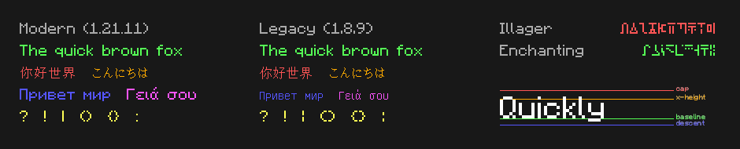

# mctext

Minecraft text formatting, parsing, and rendering library. Features all the exact glyphs used ingame, for the fonts of both pre and post-1.13.

## Language Support

| Language | Package | Registry |
|----------|---------|----------|
| Rust | `mctext` | [crates.io](https://crates.io/crates/mctext) |
| Python | `mctext` | [PyPI](https://pypi.org/project/mctext) |
| JavaScript | `@hexze/mctext` | [npm](https://npmjs.com/package/@hexze/mctext) |

## Features

- **Builder API** - Fluent interface for constructing formatted text
- **Color Support** - All 16 named Minecraft colors plus RGB hex colors
- **Style Handling** - Bold, italic, underlined, strikethrough, obfuscated
- **Font Rendering** - Measure and render text with authentic Minecraft fonts
- **Legacy Support** - Parse `§` formatting codes and JSON chat components

## Font Showcase



## Fonts Only

Looking for just the TTF files? Download them from the [releases page](https://github.com/hexze/mctext/releases):

- `minecraft-fonts-modern.zip` - Latest Minecraft fonts (updated, cleaner look)
- `minecraft-fonts-legacy.zip` - Classic fonts for those who prefer pre-1.13
- `minecraft-fonts-special.zip` - Enchanting and Illager fonts

## Installation

### Rust

```toml
[dependencies]
mctext = "1.0"
```

### Python

```bash
pip install mctext
```

### JavaScript

```bash
npm install @hexze/mctext
```

## Quick Start

### Rust

```rust
use mctext::{MCText, NamedColor};

let text = MCText::new()
    .add("Red ").color(NamedColor::Red)
    .then("Bold").color(NamedColor::Red).bold()
    .build();

for span in text.spans() {
    println!("{}: {:?}", span.text, span.color);
}
```

### Python

```python
import mctext

text = mctext.MCText().add("Red ").color("red").then("Bold").color("red").bold().build()

for span in text.spans():
    print(f"{span.text}: {span.color}")
```

### JavaScript

```javascript
import init, { MCText } from '@hexze/mctext';

await init();

let text = new MCText().add("Red ").color("red").then("Bold").color("red").bold().build();

for (const span of text.spans()) {
    console.log(`${span.text}: ${span.color}`);
}
```

## API Reference

### MCText

The main class for working with formatted Minecraft text.

| Method | Description |
|--------|-------------|
| `new()` | Create empty MCText |
| `parse(text)` | Parse legacy `§` formatted text |
| `parseJson(json)` | Parse JSON chat component |
| `add(text)` | Start building a span, returns SpanBuilder |
| `spans()` | Get array of text spans |
| `plainText()` | Get text without formatting |
| `toLegacy()` | Convert to legacy `§` format |
| `toJson()` | Convert to JSON chat component |

### SpanBuilder

Builder for constructing formatted text programmatically.

| Method | Description |
|--------|-------------|
| `color(color)` | Set span color (name like "red" or hex "#FF0000") |
| `bold()` | Make span bold |
| `italic()` | Make span italic |
| `underlined()` | Make span underlined |
| `strikethrough()` | Make span strikethrough |
| `obfuscated()` | Make span obfuscated |
| `then(text)` | Add another span and continue building |
| `build()` | Finish building and return MCText |

### Span

A segment of text with uniform formatting.

| Property | Type | Description |
|----------|------|-------------|
| `text` | string | The text content |
| `color` | Color? | Color (named or RGB) |
| `style` | Style | Formatting flags |

### Color

Either a named Minecraft color or RGB values.

**Named colors** have these properties:
- `name` - Color name (e.g., "red", "gold")
- `code` - Format code character (e.g., 'c', '6')
- `rgb` - RGB tuple/array

**RGB colors** have:
- `r`, `g`, `b` - Individual components

### Style

| Property | Type | Description |
|----------|------|-------------|
| `bold` | bool | **Bold** text |
| `italic` | bool | *Italic* text |
| `underlined` | bool | Underlined text |
| `strikethrough` | bool | ~~Strikethrough~~ text |
| `obfuscated` | bool | Randomized/scrambled text |

### Utility Functions

| Function | Description |
|----------|-------------|
| `stripCodes(text)` | Remove all `§` codes from text |
| `countVisibleChars(text)` | Count characters excluding format codes |
| `namedColors()` | Get all 16 named Minecraft colors |

## Color Codes

| Code | Color | Code | Color |
|------|-------|------|-------|
| §0 | Black | §8 | Dark Gray |
| §1 | Dark Blue | §9 | Blue |
| §2 | Dark Green | §a | Green |
| §3 | Dark Aqua | §b | Aqua |
| §4 | Dark Red | §c | Red |
| §5 | Dark Purple | §d | Light Purple |
| §6 | Gold | §e | Yellow |
| §7 | Gray | §f | White |

## Format Codes

| Code | Effect |
|------|--------|
| §k | Obfuscated |
| §l | Bold |
| §m | Strikethrough |
| §n | Underline |
| §o | Italic |
| §r | Reset |

## Rendering

Render formatted text to RGBA pixel data using authentic Minecraft fonts.

### Rust

```rust
use mctext::{
    FontSystem, FontVersion, LayoutOptions, MCText, NamedColor,
    SoftwareRenderer, TextRenderContext,
};

let text = MCText::new()
    .add("Hello ").color(NamedColor::Red)
    .then("World").color(NamedColor::Red).bold()
    .build();

let fonts = FontSystem::new(FontVersion::Modern);
let ctx = TextRenderContext::new(&fonts);
let mut renderer = SoftwareRenderer::new(&fonts, 256, 64);

ctx.render(&mut renderer, &text, 0.0, 0.0, &LayoutOptions::new(16.0).with_shadow(true));
// renderer.buffer contains RGBA pixel data
```

### Python

```python
import mctext

text = mctext.MCText().add("Hello ").color("red").then("World").color("red").bold().build()

fonts = mctext.FontSystem.modern()
options = mctext.LayoutOptions(16.0, None, True)
result = mctext.render(fonts, text, 256, 64, options)

# result.data() returns RGBA bytes, result.width/height for dimensions
```

### JavaScript

```javascript
import init, { MCText, FontSystem, LayoutOptions, render } from '@hexze/mctext';

await init();

let text = new MCText().add("Hello ").color("red").then("World").color("red").bold().build();

let fonts = FontSystem.modern();
let options = new LayoutOptions(16.0).withShadow(true);
let result = render(fonts, text, 256, 64, options);

// result.data() returns Uint8Array of RGBA pixels
```

### Rendering API

| Class/Function | Description |
|----------------|-------------|
| `FontSystem.modern()` | Load post-1.13 fonts |
| `FontSystem.legacy()` | Load pre-1.13 fonts |
| `FontSystem.measure(text, size)` | Measure text width in pixels |
| `LayoutOptions(size)` | Create layout options with font size |
| `LayoutOptions.withShadow(bool)` | Enable drop shadow |
| `LayoutOptions.withMaxWidth(width)` | Enable text wrapping |
| `render(fonts, text, width, height, options)` | Render to RGBA buffer |

## Cargo Features

| Feature | Description |
|---------|-------------|
| `modern-fonts` | Post-1.13 Minecraft fonts (default) |
| `legacy-fonts` | Pre-1.13 Minecraft fonts |
| `special-fonts` | Enchanting and Illager fonts |
| `all-fonts` | All font variants |
| `render` | Font rendering support |
| `serde` | Serialization support |

## License

MIT
